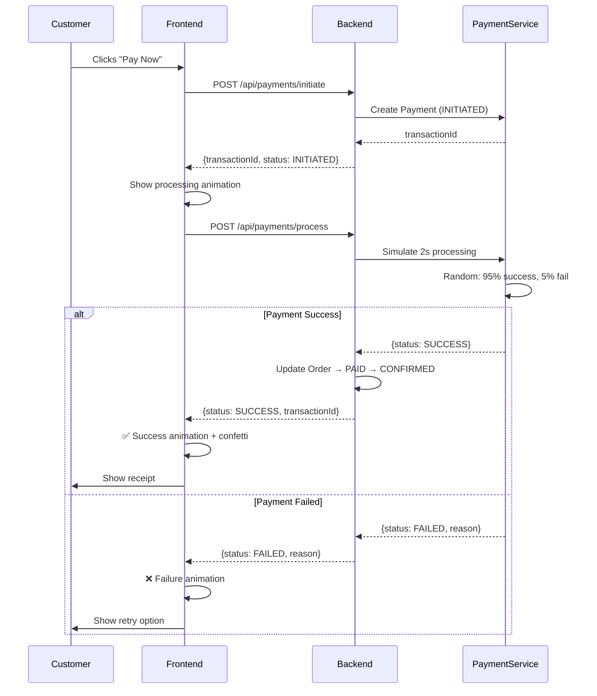

# 🛒 FreshCart — Production-Grade Online Grocery Shopping Platform

## Full-Stack Implementation Plan

---

## Current State Analysis

### Existing Spring Boot Backend (8 entities, 6 controllers, 6 services)

| Layer | Files | Status |
|-------|-------|--------|
| **Models** | `Admin`, `Customer`, `Vendor`, `Product`, `Cart`, `CartItem`, `Order`, `OrderItem` | Basic — no auth, no roles, no payment |
| **Controllers** | `AdminController`, `CustomerController`, `VendorController`, `ProductController`, `CartController`, `OrderController` | Functional but insecure — no JWT, no input validation on login |
| **Services** | `AdminService`, `CustomerService`, `VendorService`, `ProductService`, `CartService`, `OrderService` | Basic CRUD — no business logic hardening |
| **Repositories** | 8 JPA repos | Minimal custom queries |
| **Config** | `CorsConfig` (allows `localhost:5173`) | No security config |

### Critical Issues Found

| # | Issue | Severity |
|---|-------|----------|
| 1 | **No authentication/authorization** — all endpoints are wide open | 🔴 Critical |
| 2 | **Passwords stored in plain text** — no BCrypt hashing | 🔴 Critical |
| 3 | **No login endpoint** — only signup for Customer & Vendor | 🔴 Critical |
| 4 | **Duplicate DDL property** — `ddl-auto` set twice in `application.properties` (line 5 & 9) | 🟡 Medium |
| 5 | **No global exception handling** — RuntimeExceptions leak stack traces to client | 🟡 Medium |
| 6 | **No payment system at all** — orders go straight to PENDING with no payment flow | 🟡 Medium |
| 7 | **No DTOs** — entities with passwords are returned directly in API responses | 🔴 Critical |
| 8 | **`@CrossOrigin("*")`** on every controller — overly permissive CORS | 🟡 Medium |
| 9 | **`PlaceOrderRequest.address`** is accepted but never persisted on the Order entity | 🟡 Medium |
| 10 | **Stock reduction runs after order save** — not atomic, can oversell | 🟡 Medium |
| 11 | **No frontend exists** — backend only | 🔴 Required |

---

## User Review Required

> [!IMPORTANT]
> **Database Choice**: The current app uses MySQL (`jdbc:mysql://localhost:3306/grocery_db`). I will keep MySQL as-is. Please ensure MySQL is running on port 3306 with database `grocery_db` and user `root`/`root`.

> [!IMPORTANT]
> **Three User Roles**: The plan uses `Customer`, `Owner` (currently called `Vendor`), and `Admin`. The `Vendor` entity will be renamed to `Owner` in the backend to match your terminology. Confirm if you want `Vendor` → `Owner` rename or keep as `Vendor`.

> [!WARNING]
> **No Real Payment Gateway**: As requested, a **dummy payment system** will be built that simulates card, UPI, and wallet payments with realistic flows, confirmation screens, and fake transaction IDs — but no actual money is charged.

> [!IMPORTANT]
> **Frontend Framework**: I will use **Vite** (vanilla JS, no React/Vue) to build the frontend at `c:\Users\LENOVO\Downloads\full stack\frontend\`, running on port 5173 to match the existing CORS config. Confirm if this approach works.

---

## Proposed Changes

### Phase 1: Backend Security & Auth Foundation

#### [MODIFY] [pom.xml](file:///c:/Users/LENOVO/Downloads/full%20stack/springapp/pom.xml)
- Add `spring-boot-starter-security` for JWT auth
- Add `jjwt-api`, `jjwt-impl`, `jjwt-jackson` (v0.12.x) for JWT token generation
- Add `lombok` for DTOs (optional — can use records instead)

#### [NEW] config/SecurityConfig.java
- Configure Spring Security filter chain
- Whitelist public endpoints: `/api/auth/**`, `/api/products` (GET)
- Role-based access: `CUSTOMER`, `OWNER`, `ADMIN`
- BCrypt password encoder bean
- Stateless session management (JWT)

#### [NEW] config/JwtAuthFilter.java
- OncePerRequestFilter that extracts JWT from `Authorization: Bearer <token>` header
- Validates token, sets SecurityContext

#### [NEW] config/JwtService.java
- Generate JWT tokens with claims: `userId`, `role`, `email`
- Token expiry: 24 hours
- Validate and parse tokens

---

### Phase 2: Unified User Model & Auth Endpoints

#### [NEW] model/User.java
- Unified user entity replacing separate Admin/Customer/Vendor tables
- Fields: `id`, `name`, `email` (unique), `password` (BCrypt hashed), `phone`, `address`, `role` (enum: `CUSTOMER`, `OWNER`, `ADMIN`), `createdAt`, `profileImageUrl`, `isActive`
- The existing `Customer`, `Vendor`, `Admin` entities will be **kept but only used for backward compatibility** — the new `User` entity is the primary auth entity

#### [NEW] model/enums/UserRole.java
- Enum: `CUSTOMER`, `OWNER`, `ADMIN`

#### [NEW] model/enums/OrderStatus.java
- Enum: `PENDING`, `PAYMENT_PROCESSING`, `PAID`, `CONFIRMED`, `PREPARING`, `OUT_FOR_DELIVERY`, `DELIVERED`, `CANCELLED`, `REFUNDED`

#### [NEW] model/enums/PaymentStatus.java
- Enum: `INITIATED`, `PROCESSING`, `SUCCESS`, `FAILED`, `REFUNDED`

#### [NEW] model/enums/PaymentMethod.java
- Enum: `CREDIT_CARD`, `DEBIT_CARD`, `UPI`, `WALLET`, `CASH_ON_DELIVERY`

#### [NEW] controller/AuthController.java
```
POST /api/auth/register     → Register (any role)
POST /api/auth/login        → Login → returns JWT + user info
GET  /api/auth/me           → Get current user from token
PUT  /api/auth/profile      → Update profile
```

#### [NEW] dto/AuthRequest.java, AuthResponse.java, RegisterRequest.java, UserDTO.java
- Request/Response DTOs to never expose passwords in API responses

#### [NEW] service/AuthService.java
- Registration with BCrypt password hashing
- Login with credential validation
- JWT token generation on successful auth

---

### Phase 3: Enhanced Backend Features

#### [MODIFY] model/Order.java
- Add fields: `shippingAddress`, `paymentMethod`, `paymentStatus`, `transactionId`, `deliveryDate`, `trackingNotes`
- Replace String `status` with `OrderStatus` enum

#### [NEW] model/Payment.java
- Fields: `id`, `orderId`, `userId`, `amount`, `paymentMethod`, `status`, `transactionId` (UUID), `cardLastFour` (masked), `createdAt`, `updatedAt`
- Simulates a payment record

#### [NEW] controller/PaymentController.java
```
POST /api/payments/initiate           → Start dummy payment
POST /api/payments/process            → Simulate processing (2s delay)
GET  /api/payments/{transactionId}    → Get payment status
POST /api/payments/refund/{orderId}   → Simulate refund
```

#### [NEW] service/PaymentService.java
- **Dummy payment engine** with realistic flow:
  1. `initiate` → creates Payment with status `INITIATED`, returns `transactionId`
  2. `process` → simulates 2-second processing, 95% success / 5% random failure
  3. On success → updates Order status to `PAID` → `CONFIRMED`
  4. On failure → returns failure reason, allows retry
  5. `refund` → changes Payment status to `REFUNDED`

#### [MODIFY] controller/OrderController.java
- Add `PUT /api/orders/{orderId}/status` → Update order status (Owner/Admin only)
- Add `GET /api/orders/all` → All orders (Admin only)
- Add `GET /api/orders/vendor/{vendorId}` → Orders containing vendor's products (Owner only)

#### [NEW] model/Address.java
- Fields: `id`, `userId`, `label` (Home/Work/Other), `fullAddress`, `city`, `state`, `pincode`, `phone`, `isDefault`

#### [NEW] controller/AddressController.java
```
GET    /api/addresses/{userId}      → List addresses
POST   /api/addresses/{userId}      → Add address
PUT    /api/addresses/{addressId}   → Edit address
DELETE /api/addresses/{addressId}   → Delete address
```

#### [NEW] model/Coupon.java
- Fields: `id`, `code`, `discountPercent`, `maxDiscount`, `minOrderAmount`, `validUntil`, `isActive`, `usageLimit`, `usedCount`

#### [NEW] controller/CouponController.java (Admin creates, Customer applies)

#### [NEW] exception/GlobalExceptionHandler.java
- `@RestControllerAdvice` with handlers for:
  - `ResourceNotFoundException` → 404
  - `BadRequestException` → 400
  - `UnauthorizedException` → 401
  - `ValidationException` → 422
  - Generic `Exception` → 500 with safe message

#### [MODIFY] application.properties
- Remove duplicate `ddl-auto`
- Add JWT secret key
- Add `spring.jpa.hibernate.ddl-auto=update`
- Add server error handling config

---

### Phase 4: Frontend — Vite Project & Design System

#### [NEW] `c:\Users\LENOVO\Downloads\full stack\frontend\` — Vite vanilla JS project

**Design Theme: "FreshCart" — Premium Dark Grocery UI**

| Design Token | Value |
|---|---|
| Primary | `hsl(142, 71%, 45%)` — Fresh Green |
| Secondary | `hsl(38, 92%, 50%)` — Warm Orange |
| Accent | `hsl(210, 100%, 56%)` — Sky Blue |
| Background | `hsl(220, 20%, 8%)` — Deep Dark |
| Surface | `hsl(220, 18%, 12%)` — Card Surface |
| Glass | `rgba(255,255,255,0.06)` with `backdrop-filter: blur(20px)` |
| Font | `'Inter', sans-serif` (Google Fonts) |
| Border Radius | `16px` cards, `12px` buttons, `24px` search |
| Shadows | Layered green glow on CTAs |

**Animation System:**
- Page transitions: slide + fade (300ms ease)
- Card hover: `translateY(-4px)` + shadow grow
- Cart badge: bounce pulse on add
- Product image: subtle parallax on hover
- Skeleton loading screens for all data fetches
- Toast notifications: slide in from top-right
- Payment processing: animated spinner with step indicators
- Order status timeline: animated SVG progress

---

### Phase 5: Customer Dashboard & Shopping Experience

**Pages & Components:**

#### 5.1 Landing / Home Page
- Animated hero banner with rotating grocery images
- Category carousel (Fruits, Vegetables, Dairy, Bakery, Beverages, Snacks, etc.)
- "Trending Now" bento grid with product cards
- Special offers banner with countdown timer
- Search bar with debounced live results

#### 5.2 Product Catalog Page
- Bento grid layout with filter sidebar (category, price range, vendor)
- Product cards with:
  - Hover zoom on image
  - Quick "Add to Cart" button with fly-to-cart animation
  - Stock indicator badge (In Stock / Low Stock / Out of Stock)
  - Price with slash-through for discounts
  - Star rating display
- Sort by: Price (low/high), Name A-Z, Newest

#### 5.3 Product Detail Page
- Large product image with zoom
- Quantity selector with +/- buttons
- "Add to Cart" with animated confirmation
- Related products carousel
- Vendor info card

#### 5.4 Shopping Cart (Slide-out Drawer)
- Animated slide-in panel from right
- Each item: image thumbnail, name, qty adjuster, subtotal, remove button
- Live total calculation with tax (GST 5%)
- Coupon code input with apply animation
- "Proceed to Checkout" CTA button with glow

#### 5.5 Checkout Page
- Step progress bar: Address → Payment → Confirm
- Address selection/add (glassmorphism cards)
- Order summary sidebar
- Payment method selection (animated cards)

#### 5.6 Dummy Payment Flow
- **Credit/Debit Card Form**: Card number (with brand detection animation), expiry, CVV — all dummy
- **UPI**: Enter UPI ID with QR code animation (fake QR)
- **Wallet**: Animated wallet balance check → deduct
- **COD**: Simple confirmation
- Processing screen: animated spinner → success checkmark animation / failure X animation
- Payment receipt with transaction ID

#### 5.7 Order History & Tracking
- Order list cards with status badges (color-coded)
- Order detail: animated timeline showing status progression
- Re-order button

#### 5.8 Customer Profile
- Edit name, email, phone
- Address book management
- Order history link

---

### Phase 6: Owner (Vendor) Dashboard

**Completely separate dashboard layout with sidebar navigation.**

#### 6.1 Owner Dashboard Home
- Analytics cards: Total Products, Total Orders, Revenue Today, Pending Orders
- Revenue chart (bar chart with CSS-only animation)
- Recent orders table

#### 6.2 Product Management
- Product table with search & filter
- Add Product form (modal with image URL input)
- Edit Product (inline edit or modal)
- Delete Product (confirmation dialog with animation)
- Bulk stock update

#### 6.3 Order Management (Owner's products only)
- Orders containing the owner's products
- Update order status: `CONFIRMED` → `PREPARING` → `OUT_FOR_DELIVERY` → `DELIVERED`
- Status change with animated progress bar

#### 6.4 Inventory Management
- Low stock alerts (< 10 units) with warning badges
- Stock update grid
- Category-wise inventory overview

---

### Phase 7: Admin Dashboard

**Full platform control — glass morphism admin panel.**

#### 7.1 Admin Dashboard Home
- Platform stats: Total Users, Total Orders (today/week/month), Revenue, Active Products
- Animated counter cards
- Quick actions panel

#### 7.2 User Management
- Tabbed view: Customers | Owners | Admins
- User table with search
- Activate/Deactivate user toggle
- Delete user (with cascade protection dialog)
- View user details flyout

#### 7.3 Product Oversight
- All products from all vendors
- Delete product
- Flag/unflag product

#### 7.4 Order Management (All orders)
- Full order list with filters (status, date range, customer, vendor)
- Order detail view
- Override order status
- Process refunds

#### 7.5 Coupon Management
- Create/Edit/Delete coupons
- Coupon usage stats
- Toggle active/inactive

#### 7.6 Platform Analytics
- Revenue over time (CSS animated chart)
- Top selling products
- Top vendors by revenue
- Customer growth metrics

---

### Phase 8: Testing & Polish

- End-to-end flow testing for all three user roles
- Error boundary testing (network failures, invalid tokens, 404s)
- Responsive design testing (mobile, tablet, desktop)
- Animation performance optimization
- Loading state coverage (all API calls have skeleton/spinner)
- Toast notification system for all user actions
- Browser tab title and favicon

---

## File Structure Summary

### Backend — New/Modified Files

```
springapp/src/main/java/com/examly/springapp/
├── config/
│   ├── CorsConfig.java          [MODIFY — tighten origins]
│   ├── SecurityConfig.java      [NEW]
│   ├── JwtAuthFilter.java       [NEW]
│   └── JwtService.java          [NEW]
├── controller/
│   ├── AuthController.java      [NEW]
│   ├── PaymentController.java   [NEW]
│   ├── AddressController.java   [NEW]
│   ├── CouponController.java    [NEW]
│   ├── OrderController.java     [MODIFY — add status update, admin endpoints]
│   ├── AdminController.java     [MODIFY — add analytics, user management]
│   ├── ProductController.java   [MODIFY — add search, pagination]
│   ├── CartController.java      [KEEP]
│   ├── CustomerController.java  [MODIFY — merge into AuthController]
│   └── VendorController.java    [MODIFY — merge into AuthController]
├── dto/
│   ├── AuthRequest.java         [NEW]
│   ├── AuthResponse.java        [NEW]
│   ├── RegisterRequest.java     [NEW]
│   ├── UserDTO.java             [NEW]
│   ├── PaymentRequest.java      [NEW]
│   ├── PaymentResponse.java     [NEW]
│   └── OrderDTO.java            [NEW]
├── exception/
│   ├── GlobalExceptionHandler.java   [NEW]
│   ├── ResourceNotFoundException.java [NEW]
│   ├── BadRequestException.java      [NEW]
│   └── UnauthorizedException.java    [NEW]
├── model/
│   ├── User.java                [NEW — unified auth entity]
│   ├── Payment.java             [NEW]
│   ├── Address.java             [NEW]
│   ├── Coupon.java              [NEW]
│   ├── Order.java               [MODIFY — add payment fields, address]
│   ├── Product.java             [MODIFY — add fields like unit, weight]
│   └── enums/                   [NEW — UserRole, OrderStatus, PaymentStatus, PaymentMethod]
├── repository/
│   ├── UserRepository.java      [NEW]
│   ├── PaymentRepository.java   [NEW]
│   ├── AddressRepository.java   [NEW]
│   └── CouponRepository.java    [NEW]
├── service/
│   ├── AuthService.java         [NEW]
│   ├── PaymentService.java      [NEW]
│   ├── AddressService.java      [NEW]
│   └── CouponService.java       [NEW]
└── application.properties       [MODIFY]
```

### Frontend — New Project

```
frontend/
├── index.html                   [Entry point — SPA shell]
├── package.json
├── vite.config.js
├── public/
│   └── favicon.svg
├── src/
│   ├── main.js                  [App bootstrapper & router]
│   ├── api.js                   [API client with JWT interceptor]
│   ├── router.js                [Hash-based SPA router]
│   ├── store.js                 [Simple state management]
│   ├── styles/
│   │   ├── index.css            [Design system — tokens, utilities]
│   │   ├── components.css       [Reusable component styles]
│   │   ├── animations.css       [Keyframe animations library]
│   │   ├── customer.css         [Customer dashboard styles]
│   │   ├── owner.css            [Owner dashboard styles]
│   │   └── admin.css            [Admin dashboard styles]
│   ├── pages/
│   │   ├── auth/
│   │   │   ├── login.js
│   │   │   └── register.js
│   │   ├── customer/
│   │   │   ├── home.js          [Landing page with hero + categories]
│   │   │   ├── catalog.js       [Product grid with filters]
│   │   │   ├── product-detail.js
│   │   │   ├── checkout.js      [Multi-step checkout]
│   │   │   ├── payment.js       [Dummy payment UI]
│   │   │   ├── orders.js        [Order history]
│   │   │   └── profile.js       [Customer profile]
│   │   ├── owner/
│   │   │   ├── dashboard.js     [Owner analytics home]
│   │   │   ├── products.js      [Product CRUD]
│   │   │   ├── orders.js        [Order management]
│   │   │   └── inventory.js     [Inventory alerts]
│   │   └── admin/
│   │       ├── dashboard.js     [Platform analytics]
│   │       ├── users.js         [User management]
│   │       ├── orders.js        [All orders]
│   │       ├── products.js      [Product oversight]
│   │       └── coupons.js       [Coupon management]
│   └── components/
│       ├── navbar.js            [Top navigation bar]
│       ├── sidebar.js           [Dashboard sidebar]
│       ├── product-card.js      [Animated product card]
│       ├── cart-drawer.js       [Slide-out cart panel]
│       ├── toast.js             [Notification system]
│       ├── modal.js             [Reusable modal]
│       ├── skeleton.js          [Loading skeletons]
│       ├── search-bar.js        [Live search]
│       ├── status-badge.js      [Order status badge]
│       └── chart.js             [CSS-only bar charts]
```

---

## Role Separation Matrix

| Feature | Customer | Owner | Admin |
|---------|----------|-------|-------|
| Browse products | ✅ | ❌ | ❌ |
| Add to cart & checkout | ✅ | ❌ | ❌ |
| Place orders | ✅ | ❌ | ❌ |
| Make payments (dummy) | ✅ | ❌ | ❌ |
| View own orders | ✅ | ❌ | ❌ |
| Add/Edit/Delete own products | ❌ | ✅ | ❌ |
| View orders for own products | ❌ | ✅ | ❌ |
| Update order status | ❌ | ✅ | ✅ |
| Manage inventory | ❌ | ✅ | ❌ |
| View sales analytics | ❌ | ✅ | ✅ |
| Manage all users | ❌ | ❌ | ✅ |
| View all orders | ❌ | ❌ | ✅ |
| Delete any product | ❌ | ❌ | ✅ |
| Create/manage coupons | ❌ | ❌ | ✅ |
| Process refunds | ❌ | ❌ | ✅ |
| View platform analytics | ❌ | ❌ | ✅ |

---

## Dummy Payment Flow (Detailed)



---

## Verification Plan

### Automated Tests
1. Build Spring Boot backend: `mvn clean compile` — must pass with 0 errors
2. Start backend and verify all new endpoints return correct HTTP status codes
3. Run frontend dev server: `npm run dev` — must start without errors
4. Browser automation: test complete customer flow (register → browse → cart → checkout → payment → order history)

### Manual Verification
1. Register as each role and verify correct dashboard routing
2. Test product CRUD as Owner
3. Test user management as Admin
4. Test payment success and failure scenarios
5. Verify no password leaks in any API response
6. Test responsive design on different viewport sizes

---

## Open Questions

> [!IMPORTANT]
> 1. **Vendor vs Owner naming**: Should I rename `Vendor` → `Owner` everywhere, or keep it as `Vendor` in backend and only show "Owner" in the UI?

> [!IMPORTANT]
> 2. **Product images**: Since we have no file upload system, products will use `imageUrl` (external URLs). Should I use placeholder grocery images from free image APIs (like Unsplash), or generate them?

> [!IMPORTANT]
> 3. **Seed data**: Should I create a `DataLoader` that pre-populates the database with sample grocery products (fruits, vegetables, dairy, etc.) on first boot so the app isn't empty?

> [!IMPORTANT]
> 4. **H2 as fallback**: Would you like me to add H2 in-memory database as a fallback profile (`application-dev.properties`) so the app works even without MySQL installed?
